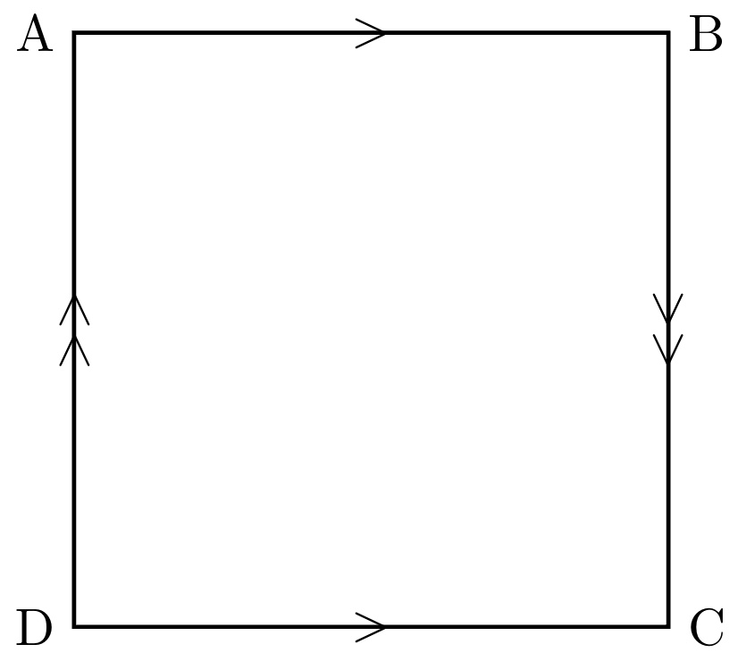
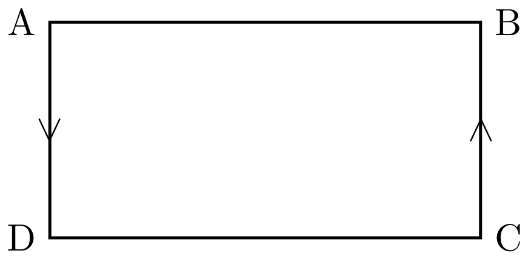
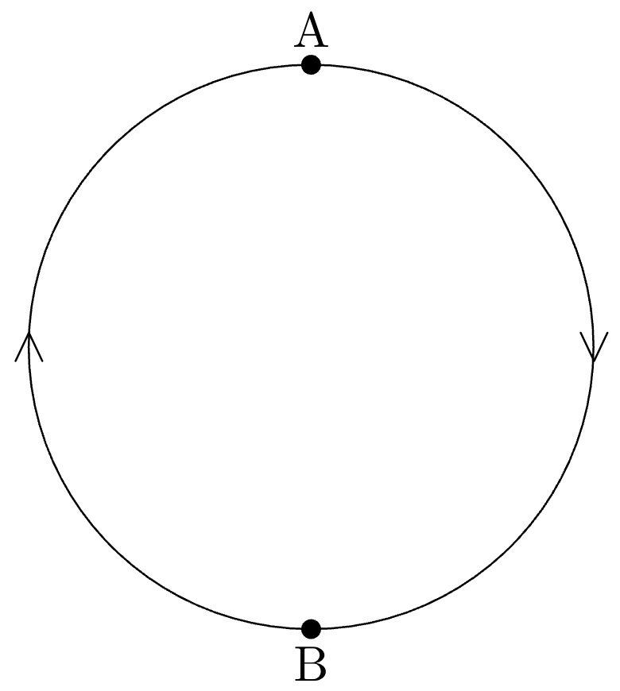

## 位相同形（同相）の定義[定義4.1]
 $X$ から $Y$ への１対１かつ上への連続写像 $f:X\rightarrow Y$ で逆写像 $f^{-1}:Y\rightarrow X$ も連続なものがあるとき、 $X$ と $Y$ は同相という。

## ２次元円板の定義[7]
 $B^2=\\{(x_1,x_2)\in \mathbb{R}^2|{x_1}^2+{x_2}^2\leqq1\\}$

## ２次元球面の定義[10]
 $S^2=\\{(x_1,x_2,x_3)\in \mathbb{R}^3|{x_1}^2+{x_2}^2+{x_3}^2=1\\}$

## トーラスの定義[10]
１次元円周 $S^1$ を２つかけあわせた曲面をトーラスという。

## クラインの壺の定義[11]
図のような正方形 $ABCD$ において $AB$ と $CD$ 、 $AD$ と $BC$ を矢印に沿って貼り合わせてできた曲面をクラインの壺という。

## メービウスの帯の定義[11]
図のような長方形 $ABCD$ において $AD$ と $BC$ を矢印に沿って貼り合わせてできた曲面をメービウスの帯という。

## 射影平面の定義[11]
図のような２次元円板において、円周上に２点 $A$ 、 $B$ を取り、弧 $AB$ と弧 $BA$ を矢印に沿って貼り合わせてできた曲面を射影平面という。

## 曲面のオイラー標数の定義[12]
 $K$ を $n$ 次元のコンパクトな単体的複体とし、 $i=0,1,2,\cdots,n$ に対して、 $\alpha_i$ を $K$ の $i$ 次元単体の個数とする。このとき、次の値を $K$ のオイラー標数という。

$$ \chi(K) = \alpha_0 - \alpha_1 + \alpha_2 - \alpha_3 + \cdots + (-1)^n\alpha_n$$

## 曲面の連結和の定義[10]
２つのトーラス $T_1$ , $T_2$ に穴をあけて繋げた曲面を連結和という。

## 球面のオイラー標数の計算[12]
球 $S$ は正四面体に同相なので、

$$
\begin{aligned}
\chi(S)
&= 4-6+4 \\
&= 2
\end{aligned}
$$

また正六面体にも同相なので、

$$
\begin{aligned}
\chi(T)
&= 8-12+6 \\
&= 2
\end{aligned}
$$

## トーラスのオイラー標数の計算[12]
トーラス $T$ は四角形からなるドーナツ状の立体に同相なので、

$$
\begin{aligned}
\chi(T)
&= 16-32+16 \\
&= 0
\end{aligned}
$$

## $\chi(S_1 ＃ S_2)= \chi(S_1) + \chi(S_2)-2$ の証明[定理12.2]
 $S_1$ 、 $S_2$ に穴をあけることを、三角形を１つずつ取り除くと考える。 $S_1 ＃ S_2$ の頂点の数 $V$ 、辺の数 $E$ 、面の数 $F$ を考える。
 
 そのために、 $S_1$ の $V_1$ 、 $E_1$ 、 $F_1$ 、 $S_2$ の $V_2$ 、 $E_2$ 、 $F_2$ を考える。このとき、次が成り立つ。

$$ V = V_1+V_2-3, E = E_1+E_2-3, F = F_1+F_2-2$$

よって、

$$
\begin{aligned}
\chi(S_1 ＃ S_2) 
&= (V_1+V_2-3)-(E_1+E_2-3)+(F_1+F_2-2) \\
&= (V_1-E_1+F_1)+(V_2-E_2+F_2)-2 \\
&= \chi(S_1) + \chi(S_2) -2
\end{aligned}
$$

となり、等式は示された。

## $\chi(F_g)= 2-2g$ の証明[定理12.3]
(I) $g=0$ のとき、

$$
\begin{aligned}
(\text{左辺}) &= \chi(F_0)= \chi(S^2)=2 \\
(\text{右辺}) &= 2-2\cdot 0=2
\end{aligned}
$$

$\therefore$ 等式が成り立つ。

(II) $g=k$ のとき、等式が成り立つと仮定すると、 $\chi(F_k)=2-2k$

$g=k+1$ のとき、

$$
\begin{aligned}
\chi(F_{k+1}) 
&= \chi(F_k ＃ F_1) \\
&= \chi(F_k) + \chi(F_1) -2 \\
&= 2-2k+0-2 \\
&= 2-2(k+1)
\end{aligned}
$$

$\therefore$ 数学的帰納法により、すべての $g$ について $\chi(F_g)= 2-2g$ が成り立つ。

## １次元多様体の分類定理[定理8.1]（証明不要）
 $M$ をコンパクトな１次元多様体とすると、 $M$ は単位円周 $S^1=\\{(x_1,x_2)\in \mathbb{R}^2|{x_1}^2+{x_2}^2=1\\}$ または単位区間 $I=[0,1]$ に同相である。

## ２次元多様体の分類定理[定理10.2, 11.4]（証明不要）
任意の向き付け可能閉曲面は、ある $F_g (g\geqq 0)$ に同相であり、任意の向き付け不可能閉曲面は、ある $N_g (g>0)$ に同相である。

## 閉曲面の文字列表示
### (1) $\Sigma=abca^{-1}c^{-1}b^{-1}$
$x=bc$ とおくと、 $x^{-1}=c^{-1}b^{-1}$ なので、

$\Sigma=axa^{-1}x^{-1}$ より、 $\Sigma$ はトーラス。

### (2) $\Sigma=abcb^{-1}a^{-1}c$
$x=ab$ とおくと、 $x^{-1}=b^{-1}a^{-1}$ なので、

$\Sigma=xcx^{-1}c$ より、 $\Sigma$ はクラインの壺。

### (3) $\Sigma=abacb^{-1}c$
$x=ab$ とおくと、 $x^{-1}=b^{-1}a^{-1}, x^{-1}a=b^{-1}$ なので、 $\Sigma=xacx^{-1}ac$ 

$y=ac$ とおくと、 $\Sigma=xyx^{-1}y$ より、 $\Sigma$ はクラインの壺。

### (4) $\Sigma=abca^{-1}b^{-1}c^{-1}$
$x=ab$ とおくと、 $x^{-1}=b^{-1}a^{-1}, x^{-1}a=b^{-1}$ なので、 $\Sigma=xca^{-1}x^{-1}ac^{-1}$ 

$y=ca^{-1}$ とおくと、 $y^{-1}=ac^{-1}$ なので、

$\Sigma=xyx^{-1}y^{-1}$ より、 $\Sigma$ はトーラス。

### (5) $\Sigma=z^{-1}xzwx^{-1}w^{-1}$
$\Sigma\sim w^{-1}z^{-1}xzwx^{-1}$

$a=w^{-1}z^{-1}$ とおくと、 $a^{-1}=zw$ なので、

$\Sigma=axa^{-1}x^{-1}$ より、 $\Sigma$ はトーラス。

### (6) $\Sigma=axya^{-1}y^{-1}x^{-1}czwc^{-1}w^{-1}z^{-1}$
$b=xy, d=zw$ とおくと、 $b^{-1}=y^{-1}x^{-1}, d^{-1}=w^{-1}z^{-1}$ なので、

$\Sigma=aba^{-1}b^{-1}cdc^{-1}d^{-1}$ より、 $\Sigma$ は $F_2$ 。

